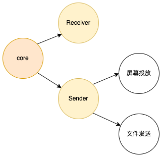

# 核心延伸
一个基于[simple-peer](https://www.npmjs.com/package/simple-peer)封装的多包仓库📦，以<strong>@abmao/magic-webrtc</strong>包延伸功能，每一个功能组即是一个npm包。




## 安装
安装依赖
```
npm i @abmao/magic-webrtc
```

## Api

### Sender
发送端
#### 类型
```ts
class Sender extends MagicWebrtc {
    constructor(options?: SenderOptions);
    addReceiverSDP(sdp: any): void;
    addReceiverCandidate(candidate: any): void;
}
interface SenderOptions {
    /**
    * simple-peer options 透传，会和默认值做覆盖合并
    * 详看 https://github.com/feross/simple-peer#api
    */
    timeout?: number;
    peer?: PeerPacking;
}
```

#### 详细信息
构造函数**SenderOptions**的peer是simple-peer options 透传，会和默认值做覆盖合并，timeout触发连接检测是否连接的时间，默认5000ms

#### 示例
```js
import { Sender } from '@abmao/magic-webrtc'
const sender = new Sender()
sender.on('offer', (sdp) => {
  console.log('offer', sdp)
})
sender.on('candidate', (candidate) => {
  console.log('candidate', candidate)
})
sender.on('startConnect', () => {
  console.log('startConnect')
})
// 放在恰当的位置交换信令
sender.addReceiverSDP(sdp) 
sender?.addReceiverCandidate(candidate);
```

-----------

### Receiver
接收端
#### 类型
```ts
class Receiver extends MagicWebrtc {
    constructor(options?: ReceiverOptions);
    addSenderSDP(sdp: any): void;
    addSenderCandidate(candidate: any): void;
}
interface ReceiverOptions {
    /**
    * peer 传递的是simple-peer options 透传，会和默认值做覆盖合并
    * 详看 https://github.com/feross/simple-peer#api
    */
    peer?: PeerPacking;
    timeout?: number;
}
```
#### 详细信息
构造函数**ReceiverOptions**的peer是simple-peer options 透传，会和默认值做覆盖合并，timeout触发连接检测是否连接的时间，默认5000ms

#### 示例
```js
import { Receiver } from '@abmao/magic-webrtc'
const receiver = new Receiver()
receiver.on('answer', (answerSdp) => {
  console.log('answer', answerSdp)
})
receiver.on('candidate', (candidate) => {
  console.log('candidate', candidate)
})
receiver.on('startConnect', () => {
  console.log('startConnect')
})
// 放在恰当的位置交换信令
receiver.addSenderSDP(sdp) 
receiver?.addSenderCandidate(candidate);
```

--------
### 事件
```ts
// EventNames定义了所有事件
import { EventNames } from '@abmao/magic-webrtc'
```
以下只描述了该库的事件，**simple-peer**相关事件自行查看

### 
#### 类型
发送端事件
```ts
// offer
on(event: EventNames.Offer, listener: (data: any) => oid): this 
```
接收端事件
```ts
// answer
on(event: EventNames.Answer, listener: (data: any) => oid): this 
```
公共事件
```ts
// 连接成功
on(event: EventNames.StartConnect, listener: (iceConnectionState: 'connected' | 'completed') => void): this
// 检测是否连接
on(event: EventNames.CheckConnect, listener: (connecSucc: boolean) => void): this 
// Candidate
on(event: EventNames.Candidate, listener: (data: any) => void): this
// Renegotiate
on(event: EventNames.Renegotiate, listener: (data: any) => void): this 
// TransceiverRequest
on(event: EventNames.TransceiverRequest, listener: (data: any) => void): this
```


#### 示例
发送端事件
```ts
// offer
sender.on(EventNames.Offer, (data: any) => {}) 
```
接收端事件
```ts
// answer
receiver.on(EventNames.Answer, (data: any) => {})
```
公共事件
```ts
 // 连接成功
sender.on(EventNames.StartConnect, (iceConnectionState: 'connected' | 'completed') => {})
// 检测是否连接
sender.on(EventNames.CheckConnect, (connecSucc: boolean) => {}) 
// Candidate
sender.on(EventNames.Candidate, (data: any) => {}) 
// Renegotiate
sender.on(EventNames.Renegotiate, (data: any) => {}) 
// TransceiverRequest
sender.on(EventNames.TransceiverRequest, (data: any) => {}) 
```